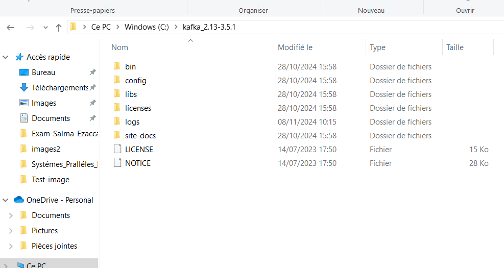
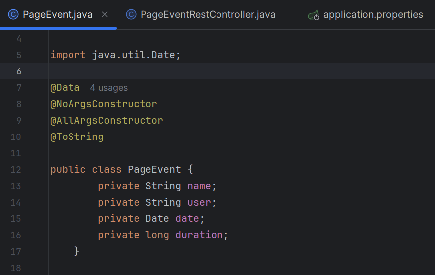
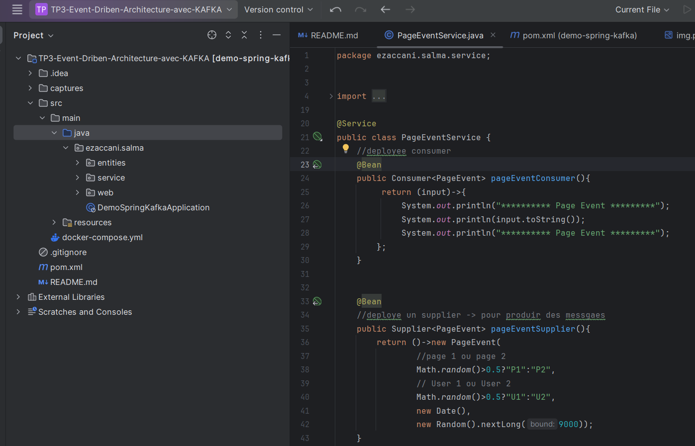
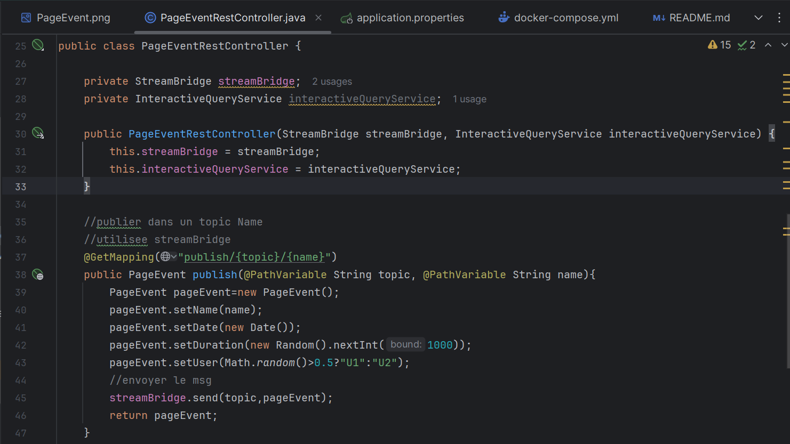
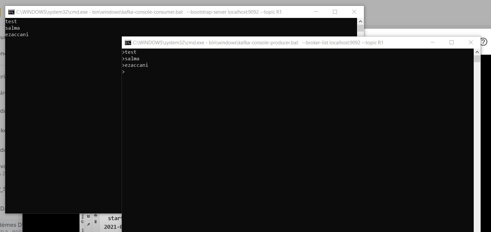
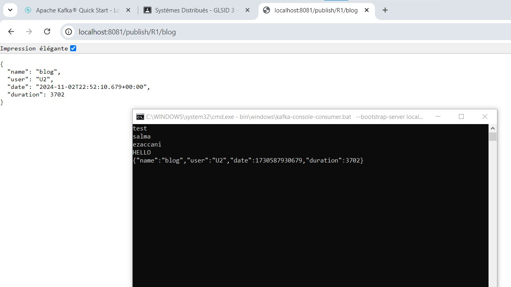
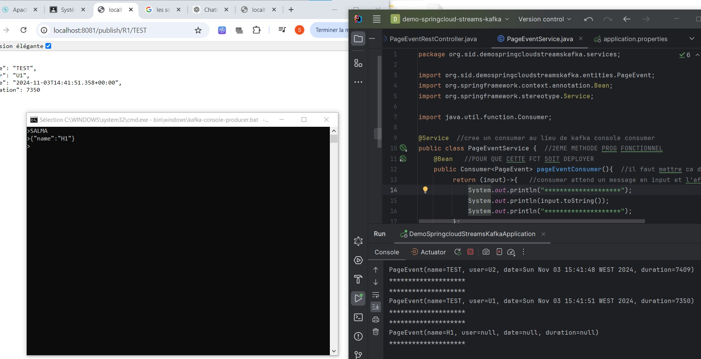
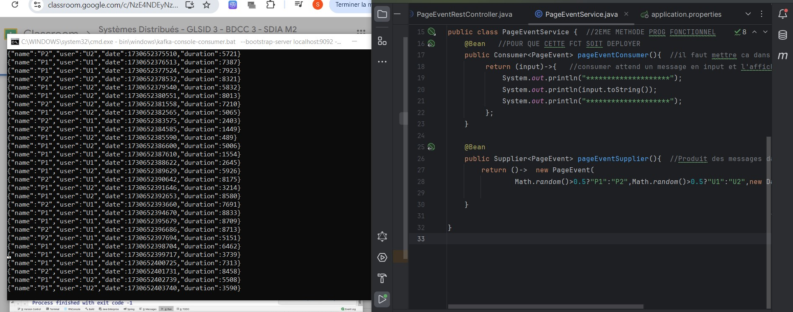

## Salma EZACCANI Master SDIA 2

# 1- Utilisation de kafka 

# 2- Utilisation de Docker avec Kafka

## Étapes d'utilisation

# 1 Projet avec Kafka et Spring Cloud Streams

### PageEvent :

### PageEventService :

### PageEventRestController :

# Result :

