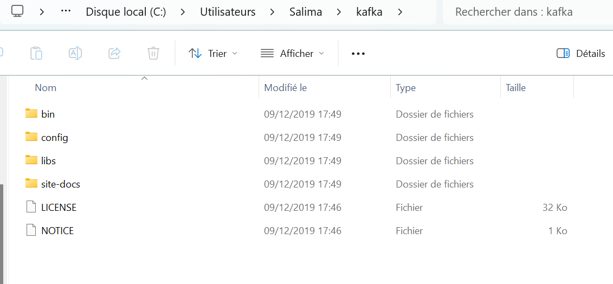
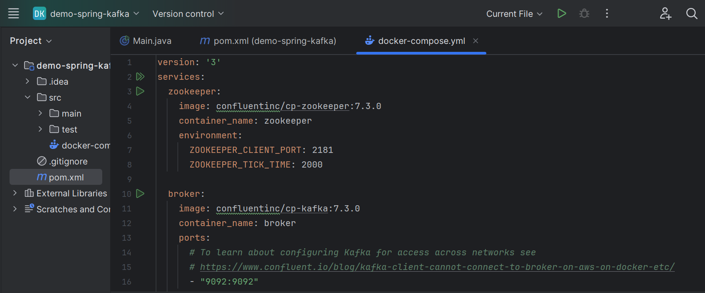
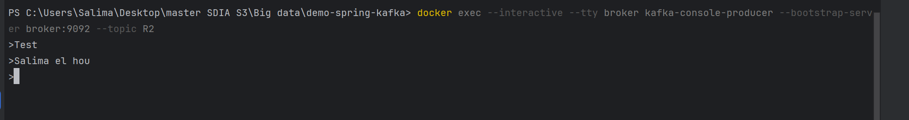
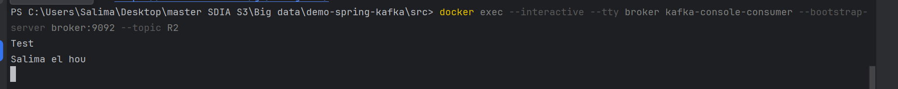
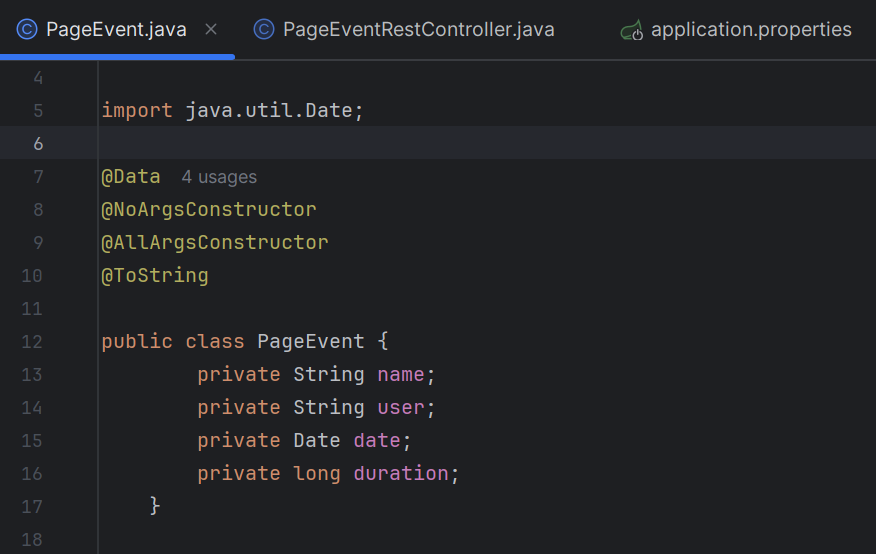
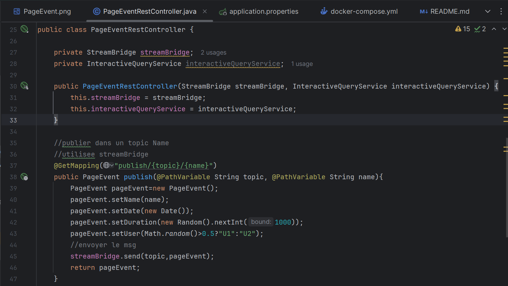
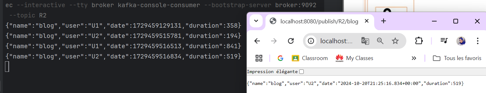
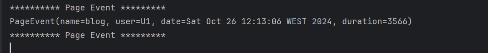
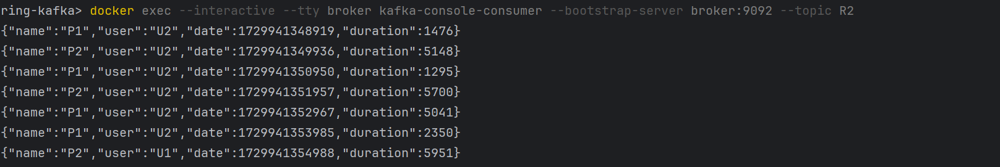
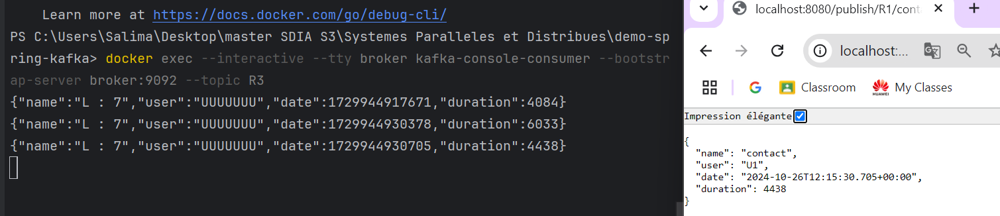

## Salima EL HOU SDIA 2

# 1- Utilisation de kafka 




# 2- Utilisation de Docker avec Kafka

## Étapes d'utilisation

### 1. Créer le fichier `docker-compose.yml`



### 2. Démarrer les conteneurs Docker

Dans le répertoire où se trouve votre fichier `docker-compose.yml`, exécutez la commande suivante pour démarrer les conteneurs Docker :

```bash
docker-compose up -d
```


### 3. Tester avec Kafka-console-producer et Kafka-console-consumer


#### Tester avec kafka-console-producer

Pour envoyer des messages à un topic Kafka, utilisez la commande suivante dans le conteneur :

```bash
kafka-console-producer --broker-list localhost:9092 --topic test
```


#### Tester avec kafka-console-consumer

Pour lire les messages depuis un topic Kafka, exécutez la commande suivante :

```bash
kafka-console-consumer --bootstrap-server localhost:9092 --topic test --from-beginning
```


# 3- Projet avec Kafka et Spring Cloud Streams

### PageEvent :




### PageEventRestController :




### PageEventRestController :


# Result :



Console : 




Configure bindings pour pageEventFunction -> lire a partir de R1  &  Ecrire en topic R3 :

